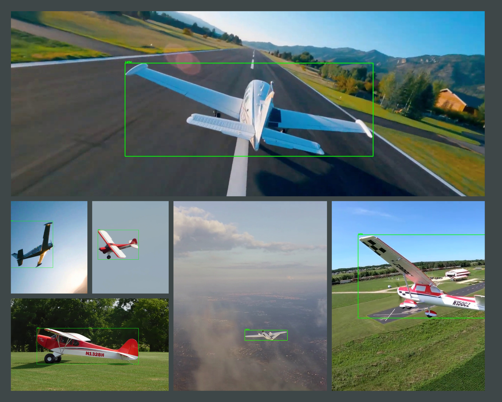

# Proje Başlığı

Bu projenin ne yaptığı ve kimin için olduğu hakkında kısa bir açıklama


# Teknofest İHA 

Bu proje Teknofest Savaşan İHA yarışmasında kullanılacak olan yazılım,
yapay zeka, dosyalama ve yazılım yönetimi konuları ile ilgilidir.

Burada yapılan çalışmalar daha sonrasında Jetson üzerinde çalışacak olan ROS2'de yardımcı fonksiyonlar olacaktır.


## Bilgisayarınızda Çalıştırın

Projeyi klonlayın

```bash
git clone https://github.com/sezer-muhammed/Eflatun-IHA.git
```

Proje dizinine gidin

```bash
cd Eflatun-IHA/EflatunIHA
```

Gerekli paketleri yükleyin

```bash
pip3 install -r requirements.txt
```


  
## Testler

Testleri çalıştırmak için aşağıdaki komutu çalıştırın

```bash
python3 tester/test.py 
```

Eğer herhangi bir hata almadan .py dosyalarının ismini görüyorsanız testler başarılıdır.
## CMD Tools

| Kod | Açıklama                |
| :-------- | :------------------------- |
| `label2view` | Verilen klasördeki label'ları görsellere çizdirir |
| `randomphotoselector` | Verilen klasörden rastgele sayıda fotoğraf çeker, çekilen görseller taşınır |
| `video2frame` | Verilen klasördeki videoları istenen aralıklarla karelere böler |
| `download_example` | Örnek verileri Google Drive'dan indirir |

## Yazarlar ve Teşekkür

- [sezer-muhammed](https://github.com/sezer-muhammed) Proje yöneticisi
- [@octokatherine](https://www.github.com/octokatherine) tasarım ve geliştirme için. [readme.so](https://readme.so/tr/)

  
## Demo

Sistemin çalışırlığını test etmek için kullanabileceğiniz bir demo kodudur. Google Drive üzerinden görselleri ve Yolo formatındaki
metin belgelerini indirir. Çıktı olarak etiketlenmiş 16 adet görsel verir.
Kodu çalıştırmak için demo.py dosyasının bulunduğu klasörde bir komut satırı çalıştırın. Komut satırında aşağıdaki kodu çalıştırın.
```bash
python3 demo.py
``` 
Kodun çıktıları "eflatun_iha_test_datas" klasörüne kaydedilecektir. Çıktıların görünüşleri şu şekilde olmalıdır.



  
## Lisans

[lgpl-3.0](https://choosealicense.com/licenses/lgpl-3.0/)